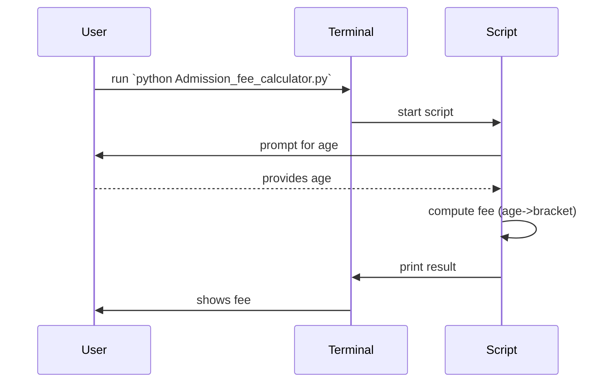

# 🚀 Emobilis — Python Week 2 Assignment

Welcome to the Emobilis Week 2 Python assignment collection. This repository contains several small Python scripts that demonstrate basic concepts: conditionals, lists, dictionaries, functions, user input, and simple control flow. The README below documents the project structure, how to run the examples on Windows PowerShell, quick usage notes, and simple Mermaid diagrams to visualise the project layout and a sample runtime flow.

## 📁 Project structure

Below is the list of files included in this folder and a one-line purpose for each.

- `Admission_fee_calculator.py` — Calculate admission fee (likely age-based discounts/fees).
- `age.py` — Utilities or examples for working with ages / age-based classification.
- `collection_sorter.py` — Demonstrates sorting a collection (list) and printing results.
- `collection_sorter2.py` — Variant of a sorter (different algorithm or input style).
- `Dictionary_Access.py` — Shows how to access and use Python dictionaries.
- `Discount.py` — Small example to compute discounts given price/percent.
- `Even_or_odd_analylzer.py` — Checks numbers for even/odd and reports results.
- `fruit.py` — Simple data / operations involving fruits (lists, membership, etc.).
- `Grade_classifier.py` — Classifies numeric scores into grades (A, B, C...).
- `Login_Attempts.py` — Demonstrates tracking or limiting login attempts (control flow).
- `Login.py` — Simple username/password or credential checking example.
- `Membership_Checker.py` — Checks if an item/user is a member of a set/list.
- `Nested_Data_Lookup.py` — Example of looking up nested structures (dicts/lists).
- `Score_List_Evaluator.py` — Evaluates a list of scores (min/max/average etc.).
- `Type_Identifier.py` — Shows how to check or print Python types at runtime.
- `Weekend_detector.py` — Determines whether a given day/date is a weekend.
- `README.md` — (this file) Human-friendly documentation for the assignment.


## Stuctures

Project file tree (simple view):

```mermaid
flowchart TB
	subgraph repo [Emobilis-Python-Assignment]
		A[Admission_fee_calculator.py]
		B[age.py]
		C[collection_sorter.py]
		C2[collection_sorter2.py]
		D[Dictionary_Access.py]
		E[Discount.py]
		F[Even_or_odd_analylzer.py]
		G[fruit.py]
		H[Grade_classifier.py]
		I[Login_Attempts.py]
		J[Login.py]
		K[Membership_Checker.py]
		L[Nested_Data_Lookup.py]
		M[Score_List_Evaluator.py]
		N[Type_Identifier.py]
		O[Weekend_detector.py]
		R[README.md]
	end
	repo --> A
	repo --> B
	repo --> C
	repo --> C2
	repo --> D
	repo --> E
	repo --> F
	repo --> G
	repo --> H
	repo --> I
	repo --> J
	repo --> K
	repo --> L
	repo --> M
	repo --> N
	repo --> O
	repo --> R
```



Sample runtime sequence (user runs a script that asks for input):



## ✅ How to run (PowerShell on Windows)

Open PowerShell in the folder `c:\Users\Test\Desktop\Python Assignment` (or navigate there):

```powershell
# Navigate to the project folder (run in PowerShell)
cd 'C:\Users\Test\Desktop\Python Assignment'

# Run a script (example)
python Admission_fee_calculator.py

# Or run any other script, e.g.:
python Grade_classifier.py
```

If you have multiple Python versions, use `python3` or the full path to your interpreter. These scripts are intended for interactive runs (they may prompt for input) and for simple demonstration/testing; no external dependencies are required.

## 📌 Usage notes and assumptions

- Many files in this assignment are single-file scripts meant to be run from the command line. They likely use `input()` for user interaction and print results to stdout.
- I made lightweight, reasonable assumptions about each file's behaviour from the filename. If you want exact run examples or automated tests, I can open each file and add precise instructions and sample inputs/outcomes.
- No virtual environment or extra packages appear necessary for these basic exercises.

## 🧪 Suggested quick tests (happy-path + edge cases)

- Admission fee: test with ages 3, 10, 17, 25, 67 to cover child/teen/adult/senior brackets.
- Grade classifier: test with 0, 49, 50, 75, 89, 100 and invalid string input.
- Even/odd analyzer: test with 0, -1, 2, 99 and non-integer input.

Run example in PowerShell:

```powershell
python Grade_classifier.py; python Even_or_odd_analylzer.py
```

## 🔧 Next steps I can help with

- Open each file and add exact usage examples and sample inputs/outputs.
- Add simple unit tests (pytest or unittest) for a few scripts.
- Add a single runner script that showcases each exercise in sequence.

## 📝 Credits & contact
Marklewis Mutugi - [Portfolio](https://marklewis-verse-folio.vercel.app/)

---

